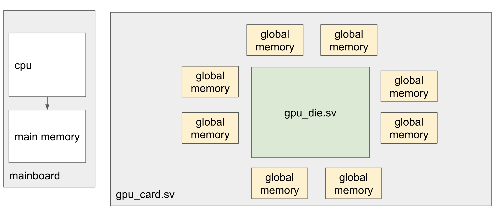

# OpenSource GPU

Build an opensource GPU, targeting ASIC tape-out, for [machine learning](https://en.wikipedia.org/wiki/Machine_learning)  ("ML"). Hopefully, can get it to work with the [PyTorch](https://pytorch.org) deep learning framework.

# Vision

Create an opensource GPU for machine learning.

I don't actually intend to tape this out myself, but I intend to do what I can to verify somehow that tape-out would work ok, timings ok, etc.

Intend to implement a [HIP](https://github.com/ROCm-Developer-Tools/HIP) API, that is compatible with [pytorch](https://pytorch.org) machine learning framework. Open to provision of other APIs, such as [SYCL](https://www.khronos.org/sycl/) or [NVIDIA® CUDA™](https://developer.nvidia.com/cuda-toolkit).

Internal GPU Core ISA loosely compliant with [RISC-V](https://riscv.org/technical/specifications/) ISA. Where RISC-V conflicts with designing for a GPU setting, we break with RISC-V.

Intend to keep the cores very focused on ML. For example, [brain floating point](https://en.wikipedia.org/wiki/Bfloat16_floating-point_format) ("BF16") throughout, to keep core die area low. This should keep the per-core cost low. Similarly, Intend to implement only few float operations critical to ML, such as `exp`, `log`, `tanh`, `sqrt`.

# Architecture

Big Picture:

GPU Die Architecture:

Single Core:

Single-source compilation and runtime

# Simulation

<!--  -->

<!--  -->

## Single-source C++

Single-source C++:

- [examples/cpp_single_source/sum_ints.cpp](/examples/cpp_single_source/sum_ints.cpp)

Compile the GPU and runtime:

- CMakeLists.txt: [src/gpu_runtime/CMakeLists.txt](/src/gpu_runtime/CMakeLists.txt)
- GPU runtime: [src/gpu_runtime/gpu_runtime.cpp](/src/gpu_runtime/gpu_runtime.cpp)
- GPU controller: [src/gpu_controller.sv](/src/gpu_controller.sv)
- Single GPU RISC-V core: [src/core.sv](/src/core.sv)

Compile the single-source C++, and run:

- [examples/cpp_single_source/run.sh sum_ints](/examples/cpp_single_source/run.sh)

# Planning

What direction are we thinking of going in? What works already? See:

- [docs/planning.md](docs/planning.md)

# Tech details

Our assembly language implementation and progress. Design of GPU memory, registers, and so on. See:

- [docs/tech_details.md](docs/tech_details.md)

# Verification

If we want to tape-out, we need solid verification. Read more at:

- [docs/verification.md](docs/verification.md)

# Metrics

we want the GPU to run quickly, and to use minimal die area. Read how we measure timings and area at:

- [docs/metrics.md](docs/metrics.md)

<!-- # What can I do with VeriGPU?

Well, aside from taping it out, which is going to be very expensive, you can:
- run simulations of a single core
    - Experiment with various core designs
    - Measure clock cycles for various operations under each design
    - Measure die area (as a ratio of number of NAND gates equivalent) for different designs
    - Measure maximum propagation delay (as a ratio of number of NAND gates equivalent) for different designs
- run simulations on a single compute unit (coming soon!)
    - similar experiments as for a single core, but on an entire compute unit, containing multiple cores
- run simulations on an entire GPU die, including gpu controller (using supplied global memory simulator) -->

<!-- # Why work on something that we might never be able to make for real?

Well, it's not certain that it can never be built. If we actually create a plausibly verified and working GPU design, there is a bunch of VC around to tape it out.

But, in the mean-time... there are a number of things that are hard or extremely expensive to run for real, such as:
- plasmas (in a fusion reactor for example)
- space rockets
- mars landers
- ... and also VLSI ASICs, such as GPUs

In all cases, one of the main approaches to the problem is to create high-quality simulations. In the case of plasmas for fusion reactors, this is pretty challenging, since we cannot even 'see' the ground-truth. Light is just another particle, and it interacts with the plasma. Ultimately we just see how much energy is created, and some of the particles emitted. The plasma simulations are used to test various hypotheses about what is happening, to 'reverse engineer' the plasma.

In the case of GPUs, simulation is relatively straightforward. CMOS circuitry is relatively deterministic, at least at the cell level, and there are a number of high quality simulators available, such as [iverilog](http://iverilog.icarus.com/) and [verilator](https://www.veripool.org/verilator/). We can use [yosys](https://github.com/YosysHQ/yosys) to synthesize down to gate-level cells, and then we can run simulations on that. We can run the GPU in these simulators, and tweak things to our heart's content. Want a GPU with only BF16? Tweak the code. Actually I intend to make it pure FP16 anyway, but it's just an example. Want to change the number of cores per multiprocessor, or the trade-off between clock frequency and instruction latency? Tweak the code :)

I feel that being able to work on projects in the absence of being able to 'just try things out' for real is plausibly a useful and valuable skill.

(to do: I need to write some instructions on how to quickly get stuck into running the simulations :) ) -->

<!-- # Why not target/test on FPGA?

In my previous experience on OpenCL, i.e. [DeepCL](https://github.com/hughperkins/DeepCL), [cltorch](https://github.com/hughperkins/cltorch), [coriander](https://github.com/hughperkins/coriander), where ironically I only had access to an NVIDIA® GPU to run them :P, I found that everything I did became optimized in various subtle ways for NVIDIA® GPUs, and when I finally got a brief access to an AMD® GPU, performance was terrible. The difference between an FPGA and an ASIC is considerable. For example, FPGAs contain their own built-in routing architecture, flip-flops work slightly differently, resets work slightly differently, FPGAs can have 'initial' blocks, and memory is laid out differently in an FPGA. I feel that even touching an FPGA will 'taint' the design in various subtle ways, that will be hard to detect. In machine learning parlance, I feel we will 'over-fit' against the FPGA, and fail to generalize correctly to ASIC.

So, simulation is the way forward I feel. And we need to make sure the simulations are as solid, accurate, and complete as possible. -->
